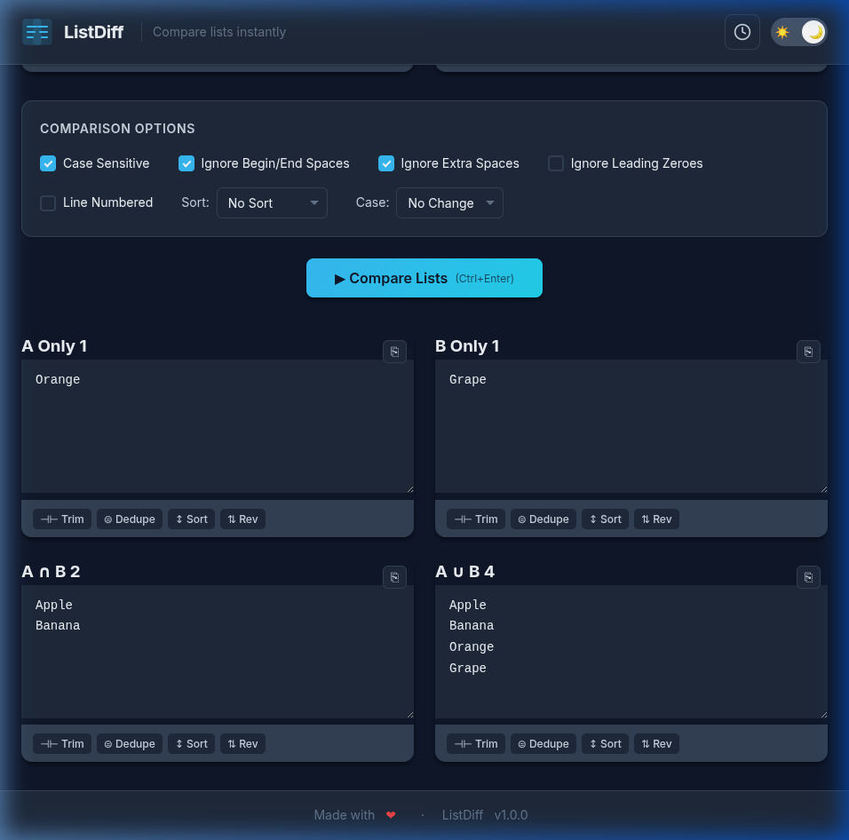

# ListDiff

> A clean, fast tool to compare two lists and find differences, intersections, and unions.



**Live**: [jadia.dev/listdiff](https://jadia.dev/listdiff)

---

## Features

- 🔍 **Compare two lists** — Find what's unique, shared, or combined
- ⚡ **Instant results** — All processing happens client-side
- 🎨 **Light & Dark themes** — Animated toggle with persistent preference
- 📋 **Toolbar actions** — Split, - **⊣⊢ Trim & ⊜ Dedupe**: Separate toolbar actions for specific cleaning.
- **Drag & Drop**: Drop `.txt` or `.csv` files directly into text areas to append content.
- **Live Diff Highlighting**: Real-time visual comparison showing matches as you type.
- **Quick Copy**: One-click floating buttons with animated "Copied!" feedback.
- **History Sidebar**: Persistent, timestamped comparison logs (LocalStorage-based).
- **Firebase Analytics**: Secure, anonymous usage logging via Cloud Firestore.
- **Production Secure**: API keys protected via GitHub Secrets and local overrides.
- 📱 **Responsive** — Desktop-first with mobile support
- ♿ **Accessible** — Semantic HTML, ARIA labels, keyboard shortcuts

---

## Quick Start

### View the Site

Open `index.html` in any modern browser. That's it — no build step needed.

For a proper local server (required for ES modules and fetch):

```bash
# Using Node.js
npx serve .

# Or Python
python3 -m http.server 8000
```

### Local Development (Secret Management)
To use Firebase analytics locally without committing your real API keys:
1. Create a `config.local.json` file (it is ignored by git).
2. Copy `config.json` contents into it and add your real `apiKey`.
3. The app will automatically use the local file first.

### Run Tests

```bash
npm install      # Install vitest (one-time)
npm test         # Run all tests (120+)
npm run test:watch  # Watch mode
```

---

## Project Structure

```
listdiff/
- `index.html` — Semantic structure & layout
- `css/styles.css` — Modern design system & animations
- `js/app.js` — Bootstrapper and module coordinator
- `js/ui.js` — Core DOM orchestration & event handling
- `js/history.js` — LocalStorage persistence & session management
- `js/comparator.js` — Pure set-logic comparison engine
- `js/utils.js` — Shared utility functions
- `js/analytics.js` — Firebase Firestore integration & Anonymous Auth
- `js/rate-limiter.js` — Client-side throttling logic
- `config.json` — Master site configuration (with placeholders)
- `config.local.json` — (Optional) Local secret overrides
```

## Local Storage Support
ListDiff keeps a history of your recently compared lists in your browser's `localStorage`. This data **never leaves your browser** and is only used to populate the "Recent Comparisons" sidebar for your convenience. You can delete specific entries at any time.

## Tests
```
├── assets/
│   └── favicon.svg      # Browser tab icon
├── tests/
│   ├── comparator.test.js
│   ├── utils.test.js
│   ├── rate-limiter.test.js
│   └── analytics.test.js
├── specifications/
│   └── spec.md          # Full project specification
├── .github/workflows/
│   └── deploy.yml       # GitHub Pages deployment
├── package.json         # Dev dependencies (vitest)
└── vitest.config.js     # Test configuration
```

---

## Configuration

All settings live in `config.json`. Key sections:

| Section | Purpose |
|---|---|
| `site` | Brand name, tagline, version, footer text |
| `firebase` | Firestore connection settings |
| `analytics` | Logging toggle, data limits, rate limits |
| `defaults` | Default checkbox/dropdown values |
| `features` | Feature flags (theme toggle, shortcuts, etc.) |

See [specifications/spec.md](specifications/spec.md) for full documentation of every config key.

---

## Firebase Setup

1. Create a Firebase project at [console.firebase.google.com](https://console.firebase.google.com/)
2. Enable **Firestore Database** in production mode
3. Set security rules:

```
rules_version = '2';
service cloud.firestore {
  match /databases/{database}/documents {
    match /audit_logs/{logId} {
      allow create: if true;
      allow read, update, delete: if false;
    }
    match /{document=**} {
      allow read, write: if false;
    }
  }
}
```

4. Copy your Firebase config into `config.json` under the `firebase` key

---

### Deployment & Secrets

1. Go to repo **Settings → Pages → Source** → select **"GitHub Actions"**.
2. Add a GitHub Secret named **`FIREBASE_API_KEY`** with your real key.
3. The `deploy.yml` workflow will automatically inject the secret into `config.json` during deployment.
4. Ensure custom domain (`jadia.dev`) is configured in DNS.

---

## Architecture

```
app.js (entry point)
├── config.js      → loads config.json via fetch()
├── theme.js       → light/dark mode toggle
├── analytics.js   → Firebase Firestore audit logging
│   └── utils.js   → data sanitization, client info
├── rate-limiter.js → throttles analytics writes
└── ui.js          → all DOM interaction
    ├── comparator.js → pure comparison logic
    └── utils.js      → trim, sort, reverse, copy, split
```

**Design principles:**
- No module touches the DOM except `ui.js` and `theme.js`
- `comparator.js` is pure functions — fully testable without a browser
- Analytics failures never break the comparison tool
- Config is loaded once and frozen — no module can accidentally modify it

---

## License

MIT
